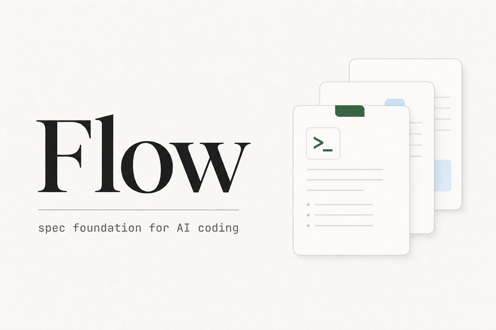

<div align="center">



<h3>好看的离线工作台 CLI · 为任意代码仓库铺设 AI 编码规范的地基</h3>

<p>
  运行 <code>flow</code> 进入交互工作台 · ↑↓ 选择 init · 生成 <code>.agentflow/</code> 骨架与薄入口<br>
  不编排工作流 · 不绑定编辑器 · 不强制模型
</p>

<p>
<a href="https://www.npmjs.com/package/@wnddd8339/flow"></a>
<a href="https://nodejs.org/"></a>
<a href="LICENSE"></a>
<a href="https://wnddd839.github.io/flow/"></a>
</p>

<p>
<a href="https://wnddd839.github.io/flow/"><b>文档站点</b></a> ·
<a href="https://www.npmjs.com/package/@wnddd8339/flow"><b>npm</b></a> ·
<a href="#工作台">工作台</a> ·
<a href="#快速开始">快速开始</a> ·
<a href="#触发话术">触发话术</a> ·
<a href="#命令">命令</a>
</p>

<br>

```bash
npm i -g @wnddd8339/flow && flow
```

<sub>无需全局安装：<code>npx @wnddd8339/flow init</code></sub>

</div>

<br>

<table>
<tr>
<td width="33%" valign="top">

**是什么**

规范层的「地基」工具

工作台 · 骨架 · 薄入口 · 存在性检查

</td>
<td width="33%" valign="top">

**不是什么**

Agent 编排器 · hook 插件 · 文档代写器

</td>
<td width="33%" valign="top">

**怎么用**

`flow` → ↑↓ 选 init → 勾选编辑器 → 打开 `prompts.md` 复制话术 → AI 填骨架

</td>
</tr>
</table>

<br>

## 三步接入

<table>
<tr>
<td align="center" width="33%"><b>① init 铺地基</b><br><sub>工作台或 <code>flow init</code>，↑↓ 选编辑器</sub></td>
<td align="center" width="33%"><b>② AI 读规范填骨架</b><br><sub>复制 <code>prompts.md</code> 话术到对话框</sub></td>
<td align="center" width="33%"><b>③ 日常协作 + check</b><br><sub><code>flow check</code> 确认文件齐全</sub></td>
</tr>
</table>

<br>

## 工作台

在 **Windows Terminal / Cursor 终端 / cmd** 里直接运行 `flow`：

<table>
<tr>
<td width="58%" valign="top">

```text
 _____ _
|  ___| | _____      __
| |_  | |/ _ \ \ /\ / /
|  _| | | (_) \ V  V /
|_|   |_|\___/ \_/\_/

 Flow · AI 编码规范工作台 · 离线 CLI

 ╭─ System Status ────────╮  ╭─ Quick Wizard ──╮
 │ Phase  not initialized │  │ 1 Setup / init  │
 │ Doctor —               │  │ 2 Doctor        │
 │ Editors none           │  │ 3 Prompts       │
 ╰────────────────────────╯  ╰─────────────────╯

 ● Setup / init — 选择编辑器   ‹推荐›
 ○ Check · ○ Prompts · ○ Tools
```

</td>
<td width="42%" valign="top">

**仪表盘** — 项目路径、阶段、健康、已启用编辑器，操作后实时刷新

**↑↓ 菜单** — 选择动作、回车确认；不可用时降级为 `flow ›` 输入

**init 向导** — 空格勾选编辑器，PATH 上的默认勾选，完成后给出下一步指引

</td>
</tr>
</table>

<br>

## 触发话术

`init` 会生成 **`.agentflow/prompts.md`** — 常见场景整段复制到 AI 对话框，不用自己拼提示词。

<table>
<tr>
<th>场景</th>
<th>何时用</th>
</tr>
<tr>
<td><b>项目首次接手</b></td>
<td>刚 init 完，AI 第一次来填骨架</td>
</tr>
<tr>
<td><b>日常开发</b></td>
<td>规范已填好，开始新任务</td>
</tr>
<tr>
<td><b>项目大更新</b></td>
<td>改架构 / 模块 / 对外行为，需同步文档</td>
</tr>
<tr>
<td><b>完成前自检</b></td>
<td>说「做完了」之前</td>
</tr>
<tr>
<td><b>Bug 修复 / 小改动</b></td>
<td>小范围修 bug，通常不必大改文档</td>
</tr>
<tr>
<td><b>接手他人改动</b></td>
<td>续作分支 / 代码审查</td>
</tr>
</table>

```bash
flow prompts    # 终端打印全文，或直接打开 .agentflow/prompts.md
```

<br>

## 快速开始

```bash
flow                          # 进入交互工作台（推荐）
flow init                     # ↑↓ 分步选择编辑器
flow init cursor claude       # 或直接指定多个平台

flow check                    # 检查骨架与薄入口
flow prompts                  # 查看可复制触发话术
```

<details>
<summary><b>非交互环境</b>（CI / 脚本 / 管道）</summary>

<br>

```bash
npx @wnddd8339/flow init claude
npx @wnddd8339/flow init --skeleton-only
```

</details>

<br>

## 按编辑器配置

内置六种 AI 编码工具，**一条命令**生成对应薄入口：

<table>
<tr>
<th>命令</th>
<th>工具</th>
<th>薄入口</th>
</tr>
<tr>
<td><code>flow init codex</code></td>
<td>Codex</td>
<td><code>AGENTS.md</code></td>
</tr>
<tr>
<td><code>flow init claude</code></td>
<td>Claude Code</td>
<td><code>CLAUDE.md</code></td>
</tr>
<tr>
<td><code>flow init cursor</code></td>
<td>Cursor</td>
<td><code>.cursor/rules/agentflow.mdc</code></td>
</tr>
<tr>
<td><code>flow init kiro</code></td>
<td>Kiro</td>
<td><code>.kiro/steering/agentflow.md</code></td>
</tr>
<tr>
<td><code>flow init qoder</code></td>
<td>Qoder</td>
<td><code>.qoder/skills/agentflow/SKILL.md</code></td>
</tr>
<tr>
<td><code>flow init antigravity</code></td>
<td>Antigravity</td>
<td><code>.agent/skills/agentflow/SKILL.md</code></td>
</tr>
</table>

```bash
flow init --skeleton-only        # 只要 .agentflow/，不要薄入口
flow init cursor claude          # 多平台 positional
flow init --editors qoder,cursor # 逗号分隔
flow init --force claude         # 覆盖已有 Flow 生成文件
```

<br>

## 生成物

<table>
<tr>
<td width="50%" valign="top">

**始终生成** — `.agentflow/` 规范目录

```
.agentflow/
├── AGENTS.md           总入口 + 维护契约
├── prompts.md          可复制触发话术
├── docs/               规范骨架（AI 填写）
│   ├── project.md      项目是什么
│   ├── conventions.md  怎么写代码
│   ├── business.md     业务是什么
│   └── pitfalls.md     踩过的坑
└── skills/README.md    skill 路由表
```

</td>
<td width="50%" valign="top">

**按需生成** — 薄入口指针

只为你勾选的平台创建文件，不会默认堆满六个工具目录。

每个薄入口只有一行指向 `.agentflow/AGENTS.md`，规范正文只维护一处。

</td>
</tr>
</table>

<br>

## 做什么 · 不做什么

<table>
<tr>
<td width="50%" valign="top">

**只做**

- 生成结构清晰的规范文档骨架
- 按平台写入指向 AGENTS.md 的薄指针
- `check` 校验文件存在性与漂移
- `editors` 管理本项目启用哪些入口

</td>
<td width="50%" valign="top">

**不做**

- 工作流编排、handoff、状态追踪
- 绑定某一编辑器的 hook / 插件
- 代替 AI 填写或校验文档内容
- 默认堆满六个平台文件夹

</td>
</tr>
</table>

<br>

## 命令

<table>
<tr>
<th>命令</th>
<th>说明</th>
</tr>
<tr>
<td><code>flow</code></td>
<td>进入交互工作台（仪表盘 + ↑↓ 菜单）</td>
</tr>
<tr>
<td><code>flow init [编辑器...]</code></td>
<td>生成 <code>.agentflow/</code>；无参数时交互选择</td>
</tr>
<tr>
<td><code>flow init --skeleton-only</code></td>
<td>仅骨架，不生成薄入口</td>
</tr>
<tr>
<td><code>flow prompts</code></td>
<td>打印 <code>.agentflow/prompts.md</code> 全文</td>
</tr>
<tr>
<td><code>flow check</code></td>
<td>检查骨架、薄入口漂移、未填写章节</td>
</tr>
<tr>
<td><code>flow editors list</code></td>
<td>查看本项目已启用编辑器</td>
</tr>
<tr>
<td><code>flow tools</code></td>
<td>检测本机 AI 编码 CLI</td>
</tr>
</table>

完整介绍见 **[文档站点 →](https://wnddd839.github.io/flow/)**

<br>

## 设计原则

<table>
<tr>
<td><b>轻巧</b><br><sub>离线 CLI，最小依赖</sub></td>
<td><b>地基优先</b><br><sub>只产结构与指针</sub></td>
<td><b>按需铺入口</b><br><sub>不默认六个平台</sub></td>
</tr>
<tr>
<td><b>边界分明</b><br><sub>每份文档只写一类信息</sub></td>
<td><b>契约靠提示词</b><br><sub>Flow 不拦截、不强制</sub></td>
<td><b>平台中立</b><br><sub>多入口，不做深度绑定</sub></td>
</tr>
</table>

<br>

## 开发

```bash
git clone https://github.com/wnddd839/flow.git
cd flow
npm install
npm run check
```

<details>
<summary><b>版本历史</b></summary>

<br>

| 版本 | 要点 |
|------|------|
| **0.6.5** | 规范骨架迁入 `.agentflow/docs/`，根目录更整洁 |
| **0.6.4** | `.agentflow/prompts.md` 场景话术 · `flow prompts` |
| **0.6.3** | 裸 `flow` 进入交互工作台 |
| **0.6.2** | `flow init` ↑↓ 分步向导 · Windows TTY 修复 |
| **0.6.1** | TypeScript 主线 · 项目级 `editors.yaml` · unfilled 检测 |
| **0.6.0** | npm 首发 `@wnddd8339/flow` |
| **≤0.5** | Python 版已归档至 [`archive/python/`](archive/python/) |

</details>

<br>

<div align="center">

<sub>Flow · MIT · <a href="https://github.com/wnddd839/flow">GitHub</a> · <a href="https://www.npmjs.com/package/@wnddd8339/flow">npm</a> · <a href="https://wnddd839.github.io/flow/">文档</a></sub>

</div>
